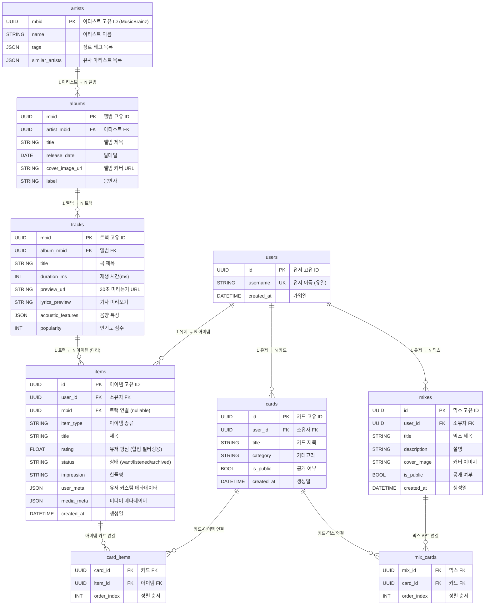
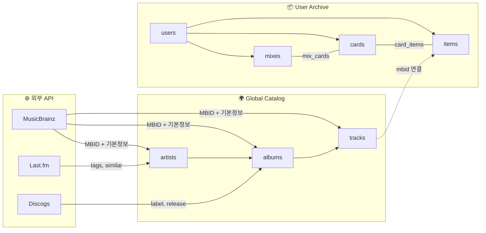

# 🗄️ Habitus 데이터베이스 설계 상세 리뷰

## 전체 구조 한눈에 보기

우리의 데이터베이스는 크게 **두 개의 세계(영역)**로 나뉘어 있습니다.

| 영역 | 파일 | 역할 | 비유 |
|------|------|------|------|
| **🌍 Global Music Catalog** | [catalog.py](file:///c:/Users/user/archive_project/backend/app/models/catalog.py) | 전 세계 공용 음악 백과사전 | 도서관의 '책 목록 카탈로그' |
| **📦 User Archive** | [archive.py](file:///c:/Users/user/archive_project/backend/app/models/archive.py) | 개인 유저의 수집/정리 공간 | 내 방 책장에 꽂아둔 '내 서재' |

핵심 아이디어: **catalog은 모든 유저가 함께 쓰는 공용 데이터**이고, **archive는 각 유저의 개인 데이터**입니다. 이 두 세계를 `Item.mbid → Track.mbid`라는 **다리 하나**로 연결합니다.

---

## ER 다이어그램 (Entity-Relationship Diagram)



---

## 🌍 영역 1: Global Music Catalog (catalog.py)

이 영역은 **MusicBrainz, Last.fm, Discogs** 같은 외부 API에서 가져온 **전 세계 공용 음악 데이터**를 저장하는 곳입니다. 유저 A가 검색해서 저장하든, 유저 B가 검색해서 저장하든 **같은 곡은 하나만 저장됩니다.**

### Artist → Album → Track (위에서 아래로 흘러내리는 계층 구조)

```
🎤 Artist (아티스트)
 └─── 📀 Album (앨범) ← artist_mbid로 연결
       └─── 🎵 Track (트랙) ← album_mbid로 연결
```

#### 🎤 artists 테이블
```python
# catalog.py Line 7~14
class Artist(Base):
    __tablename__ = "artists"
    mbid = Column(UUID, primary_key=True)   # ← MusicBrainz가 부여한 '음악 주민등록번호'
    name = Column(String, index=True)       # ← index=True: 이름으로 빠르게 검색 가능
    tags = Column(JSON, default=list)       # ← ["rock", "indie", "british"] 형태
    similar_artists = Column(JSON)          # ← ["Oasis", "Blur"] 형태
```

> [!NOTE]
> **`mbid`가 왜 `primary_key`인가?**
> 일반적으로 DB의 PK(기본키)는 자동 증가하는 숫자(1, 2, 3...)를 씁니다. 하지만 우리 서비스에서는 MusicBrainz가 이미 전 세계 모든 아티스트에게 고유한 UUID를 부여했기 때문에, 그것을 그대로 가져다 PK로 쓰는 것이 훨씬 효율적입니다. 중복 저장도 방지됩니다!

> [!NOTE]
> **`tags`와 `similar_artists`에 왜 `JSON` 타입을 썼는가?**
> 태그 목록이나 유사 아티스트 목록은 갯수가 제각각입니다. Coldplay의 태그는 3개일 수 있고, Radiohead는 10개일 수도 있죠. 이런 '유동적인 리스트'는 별도의 테이블을 만들기보다 JSON 배열(`["rock", "pop"]`)로 통째로 저장하는 것이 훨씬 간결합니다.

#### 📀 albums 테이블
```python
# catalog.py Line 16~26
class Album(Base):
    artist_mbid = Column(UUID, ForeignKey("artists.mbid"))  # ← "이 앨범은 어떤 아티스트 거?"
    
    artist = relationship("Artist", back_populates="albums")  # ← 파이썬에서 album.artist 로 접근 가능
    tracks = relationship("Track", back_populates="album")    # ← 파이썬에서 album.tracks 로 접근 가능
```

> [!IMPORTANT]
> **`ForeignKey`(외래키)가 핵심입니다!**
> `artist_mbid = ForeignKey("artists.mbid")`의 의미는:
> "이 앨범의 `artist_mbid` 컬럼에 들어가는 값은, 반드시 `artists` 테이블의 `mbid` 컬럼에 실제로 존재하는 값이어야 한다"
> 라는 **데이터 무결성 규칙**입니다. 존재하지 않는 아티스트의 앨범이 만들어지는 것을 DB 레벨에서 원천 차단합니다.

> [!NOTE]
> **`relationship` vs `ForeignKey` 차이**
> - `ForeignKey`: 실제 DB 테이블에 물리적으로 존재하는 컬럼. SQL로 변환됩니다.
> - `relationship`: DB에는 존재하지 않고, 오직 파이썬 코드 안에서만 작동하는 '편의 기능'. `album.artist.name` 처럼 점(.)으로 편하게 접근할 수 있게 해줍니다.

#### 🎵 tracks 테이블
```python
# catalog.py Line 28~39
class Track(Base):
    album_mbid = Column(UUID, ForeignKey("albums.mbid"))
    acoustic_features = Column(JSON, default=dict)  # ← {"energy": 0.8, "tempo": 120} 형태
    popularity = Column(Integer, default=0)          # ← 나중에 협업 필터링에 활용 가능
```

> [!TIP]
> **`acoustic_features`(음향 특성)은 왜 여기에?**
> 나중에 "이 곡과 분위기가 비슷한 곡 추천해 줘" 기능을 만들 때, 에너지/템포/키 같은 음향 수치를 비교해서 코사인 유사도를 계산하는 데 활용됩니다. 이것이 바로 이전 대화에서 다뤘던 **아이템 기반 추천**의 핵심 데이터입니다!

---

## 📦 영역 2: User Archive (archive.py)

이 영역은 **각 유저의 개인 수집 공간**입니다. 프론트엔드에서 유저가 곡을 저장하고, 평점을 매기고, 카드와 믹스로 정리하는 모든 행위가 이 테이블들에 기록됩니다.

### User → Mix → Card → Item (마트료시카 인형 구조)

```
👤 User (유저)
 ├─── 📚 Mix (믹스 = 카드를 모은 대분류 폴더)
 │     └─── 🃏 Card (카드 = 아이템을 모은 소분류 폴더)
 │           └─── 💎 Item (아이템 = 실제 곡/앨범 한 건)
 │                 └─── 🔗 mbid → tracks.mbid (Global Catalog과의 다리!)
 ├─── 🃏 Card (카드는 믹스 없이도 존재 가능)
 └─── 💎 Item (아이템도 카드 없이 독립적으로 존재 가능)
```

#### 👤 users 테이블
```python
# archive.py Line 24~32
class User(Base):
    id = Column(UUID, primary_key=True, default=uuid.uuid4)
    username = Column(String, unique=True, index=True)    # ← unique=True: 같은 이름 가입 불가
    created_at = Column(DateTime, server_default=func.now())  # ← DB 서버 시각으로 자동 기록
```

#### 📚 mixes 테이블 (대분류 폴더)
```python
# archive.py Line 34~45
class Mix(Base):
    user_id = Column(UUID, ForeignKey("users.id"))     # ← "이 믹스는 누구 거?"
    is_public = Column(Boolean, default=False)          # ← 다른 유저에게 공개할지 여부
    
    cards = relationship("Card", secondary=mix_cards, back_populates="mixes")
    #                              ↑↑↑ 이 secondary가 핵심!
```

#### 🃏 cards 테이블 (소분류 폴더)
#### 💎 items 테이블 (실제 아이템 한 건) ⭐️가장 중요⭐️

```python
# archive.py Line 60~75
class Item(Base):
    user_id = Column(UUID, ForeignKey("users.id"))        # ← 소유자
    mbid = Column(UUID, ForeignKey("tracks.mbid"), nullable=True)  # ← 🌉 Catalog과의 다리!
    item_type = Column(String)     # ← "track", "album", "article" 등
    rating = Column(Float, default=0.0)  # ← ⭐ 협업 필터링의 핵심 가중치!
    status = Column(String, default="want")  # ← "want" / "listened" / "archived"
    impression = Column(String, nullable=True)  # ← 유저의 한줄평
    user_meta = Column(JSON)       # ← 유저가 자유롭게 붙인 태그나 메모
    media_meta = Column(JSON)      # ← 원본 미디어의 부가 정보
```

> [!IMPORTANT]
> **`Item.mbid → Track.mbid`가 두 세계를 잇는 다리입니다!**
> 유저가 "Coldplay - Yellow"를 저장하면:
> 1. `tracks` 테이블에 Yellow의 MBID가 저장되고 (Global Catalog)
> 2. `items` 테이블에 유저의 평점/한줄평/상태가 저장되면서 (User Archive)
> 3. `items.mbid`가 `tracks.mbid`를 가리켜서 두 데이터를 연결합니다.
>
> 이 구조 덕분에 **"이 곡을 저장한 다른 유저들은 뭘 또 저장했을까?"** 같은 협업 필터링 쿼리가 가능해집니다!

> [!TIP]
> **`rating` (평점)이 왜 중요한가?**
> 이전 대화에서 논의했던 협업 필터링의 핵심이 바로 이 필드입니다.
> - 유저 A: Yellow ⭐4.5, Fix You ⭐5.0, Viva la Vida ⭐3.0
> - 유저 B: Yellow ⭐4.0, Fix You ⭐4.5, ???
>
> → "A와 B의 취향이 비슷하네? A가 좋아한 Viva la Vida를 B에게 추천하자!"
> 이 계산을 가능하게 하는 원시 데이터(Raw Data)가 바로 `rating` 컬럼입니다.

---

## 🔗 중간 테이블 (다대다 관계의 비밀)

Mix와 Card, Card와 Item 사이에는 **`mix_cards`와 `card_items`라는 '중간 테이블(Junction Table)'**이 존재합니다.

### 왜 중간 테이블이 필요한가?

```
❌ 잘못된 설계: Card 안에 Mix ID 목록을 배열로 저장
   Card { mix_ids: ["mix-1", "mix-2", "mix-3"] }
   → 검색 불가능, 수정 어려움, 데이터 무결성 보장 불가

✅ 올바른 설계: 중간 테이블로 관계를 독립적으로 관리
   mix_cards { mix_id: "mix-1", card_id: "card-A", order_index: 0 }
   mix_cards { mix_id: "mix-1", card_id: "card-B", order_index: 1 }
   mix_cards { mix_id: "mix-2", card_id: "card-A", order_index: 0 }
```

```python
# archive.py Line 8~14 (중간 테이블 정의)
mix_cards = Table(
    'mix_cards', Base.metadata,
    Column('mix_id', UUID, ForeignKey('mixes.id'), primary_key=True),
    Column('card_id', UUID, ForeignKey('cards.id'), primary_key=True),
    Column('order_index', Integer, default=0)  # ← 카드의 정렬 순서까지 저장!
)
```

> [!NOTE]
> **다대다(Many-to-Many) 관계란?**
> - 하나의 Mix 안에 여러 Card가 들어갈 수 있고 (1:N)
> - 하나의 Card가 여러 Mix에 동시에 속할 수도 있습니다 (N:1)
> - 이런 관계를 **다대다(N:M)**라고 부르며, 관계형 DB에서는 반드시 중간 테이블이 필요합니다.
> - `order_index`는 "이 카드가 믹스 안에서 몇 번째에 위치하는가"를 기록하는 정렬용 필드입니다.

---

## 📊 데이터 흐름 요약



위 다이어그램이 전체 데이터의 흐름입니다:
1. **외부 API**에서 음악 데이터를 가져와서 **Global Catalog**에 저장
2. **유저**가 곡을 탐색하고 자신의 **Archive**에 저장 (Item 생성)
3. Item의 `mbid`가 Track의 `mbid`를 가리켜서 두 세계가 연결됨
4. 유저가 Item들을 Card로 묶고, Card들을 Mix로 묶어서 정리

